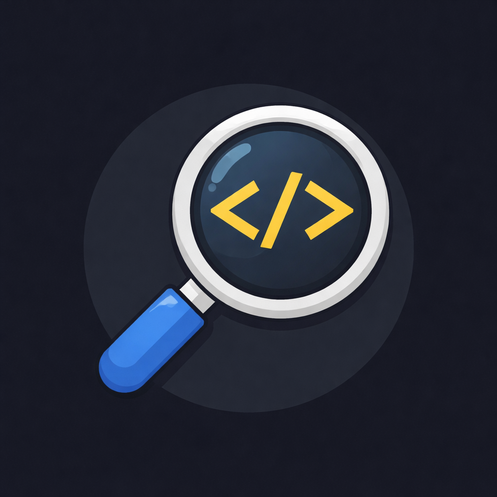

# Code Spotlight

  

**Code Spotlight** lets you magnify selected code in a dedicated panel — perfect for presentations, live demos, teaching, streaming, and screen recording.

No more squinting at small fonts or zooming your entire editor.

---

## ✨ Features

- 🔍 Magnify selected code in a separate panel  
- 🔄 **Live mode** – automatically updates as selection changes  
- 🧷 **Manual mode** – freeze the spotlight when Live is off  
- 🎯 Syntax highlighting (TypeScript, TSX, JavaScript, JSX, Python, Java, and more)  
- 🔠 Font size controls (A+ / A−)  
- 🖥️ Presentation fullscreen mode  
- 🖱️ Ctrl + Scroll zoom (works with mouse & laptop touchpad)  
- 🚀 Lightweight and fast  

---

## 📸 Demo

_Select code → Open Code Spotlight → Live toggle → Zoom → Fullscreen_

> **Tip:** Extensions with GIFs get more installs on the Marketplace.

---

## 🚀 Getting Started

1. Select any code in the editor  
2. Open the Command Palette:  
   - Windows / Linux: `Ctrl + Shift + P`  
   - macOS: `Cmd + Shift + P`  
3. Run: **Code Spotlight: Magnify Selection**  

A spotlight panel opens beside your editor.

---

## 🎛️ Toolbar Controls

| Control | Description |
| ------- | ----------- |
| A+ / A− | Increase or decrease font size |
| Live    | Toggle live selection updates |
| Fullscreen | Maximize the spotlight panel |
| Ctrl + Scroll | Zoom in/out (works with mouse wheel and laptop touchpad) |

---

## 🔄 Live vs Manual Mode

- **Live ON:** Spotlight updates automatically as you change selection  
- **Live OFF:** Spotlight stays frozen — useful when explaining a specific snippet

---

## 🧠 Why Code Spotlight?

- Presenting code in meetings  
- Teaching programming  
- Recording tutorials  
- Streaming coding sessions  
- Code walkthroughs without distracting UI

---

## 🛠 Supported Languages

Syntax highlighting is powered by PrismJS and supports:

- TypeScript / TSX  
- JavaScript / JSX  
- Python  
- Java  
- And more (automatically loaded)

---

## ⚙️ Default Shortcut (optional)

You can assign a shortcut to **Code Spotlight: Magnify Selection**:

- Windows/Linux: `Ctrl + Alt + M`  
- macOS: `Cmd + Alt + M`

---

## 📦 Extension Status

✅ Stable  
🚀 Actively developed  
🎯 Focused on clarity & presentations  

---

## 🐞 Feedback & Contributions

Found a bug or have a feature request?  
Feel free to [open an issue](https://github.com/Neel82/code-spotlight/issues) or suggestion.

---

## 📄 License

MIT
